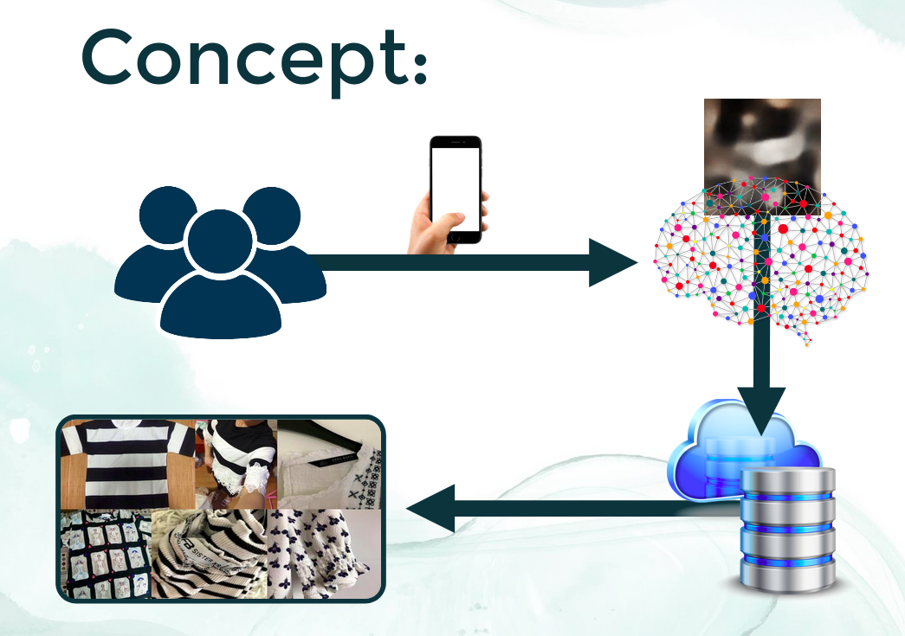
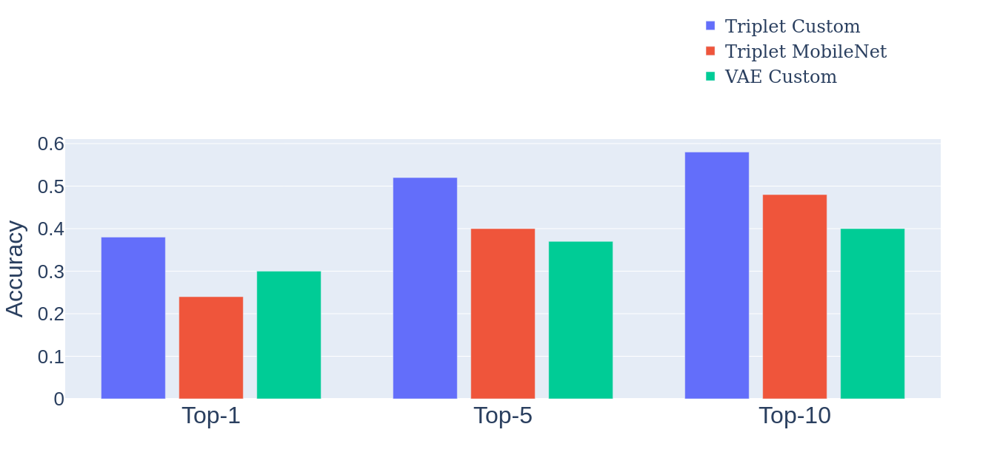

  

Circular fashion solves many ethical and environment problems of the fast-fashion industry. However, finding items that suit your style from sustainable sources, such as the second-hand market, can prove to be quite hard. Our app demonstrates how we can solve this issue with the power of deep-learning.

# [Prototype](https://sustainable-deepfashion-dash.herokuapp.com/) Solution

  

This app demonstrates our model has learned to understand the similarity between photos of fashion items with respect to their color, pattern and more, instead of relying soley on the similarity between the images themselves.
On top, we allow users to shift their predictions to add stripes or floral patterns. 
While, this functionality is limited by the rather small database (10000 items), it clearly demonstrates that this model can also be used for inspiration and exploration of the user.
Currently, the database for the predictions is focused on short-sleeved tops, which the model was trained on.

[**Feel free to try it out for yourself!**](https://sustainable-deepfashion-dash.herokuapp.com/)

# Concept

# Top-k accuracies

