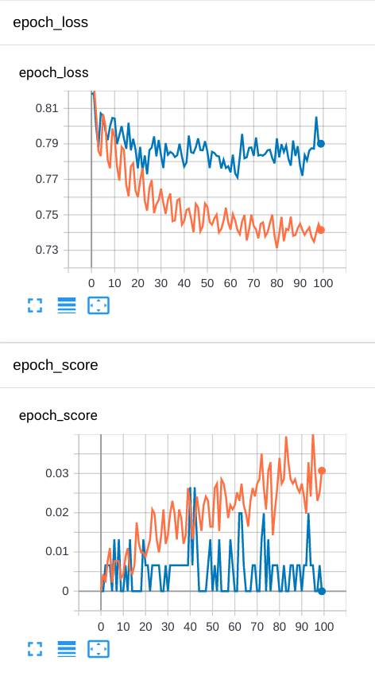
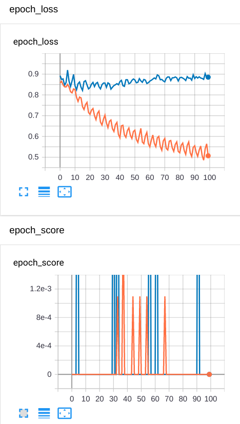

# Preliminary Results

This is a short summary of intermediate results of our effort to train a powerful and reliable model.

## Transfer Learning

The first approach was to take a basemodel, i.e. the EfficientNetB0, and freeze all the layers. 
Adding another dense layer as the new top, the model is trained on the deepfashion2 train dataset and tested on the corresponding validation dataset.
Here, we limit ourselves to only one category (top sleeves) and consider only samples that share at least 20 other samples of the same item.

### Results

The training is performed on AWS p2.xlarge instances, and one epoch takes about 4 minutes.

We make two important observations:

- The bias is very high (high training loss and low training accuracy), thus we should add more power (more layers)
- The validation loss saturates very fast to high values. Thus, we also have high variance.

To tackle this, we could implement data augmentation, and add dropout layers to the new top.

## Train everything

This run was created mostly by accident, due to an unexpected reset of the weights when modifying the trainablility of the layers and recompile the model.
Thus the training starts with loading the model from the above run, and change the layers of the basemodel to trainable.
However, apparently, the model forgot everything immediately...

We make two important observations: 
- Even with all layers trainable the training loss remains quite high -> Too large learning rate?
- The validation loss is even worse. We lost all advantages of the transfer learning.
