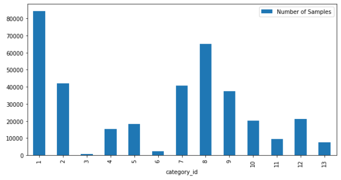
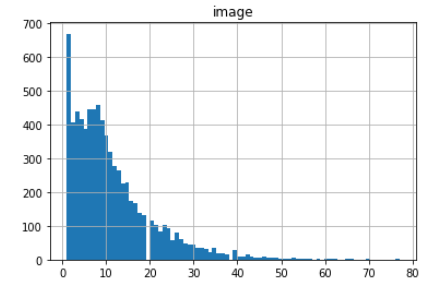
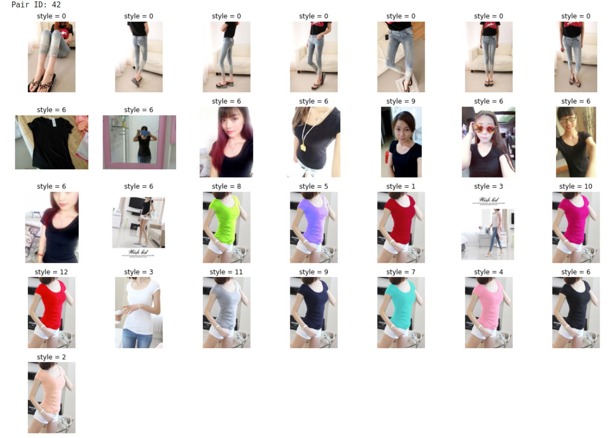
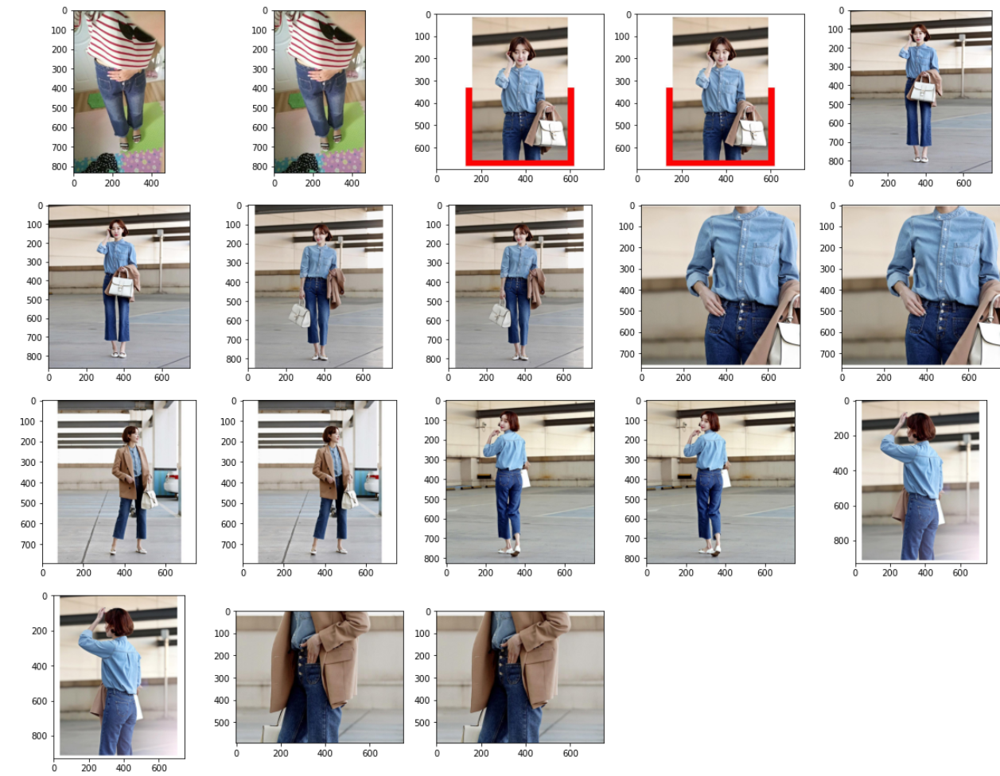

## Number of samples per category

The dataset contains different categories of clothing like short sleeve top, trousers, skirt, vest etc. We first take a look at the amount of images for every other category, as we will currently focus on one category for the project.   

As can be seen on the picture, category id 1 (short sleeve tops) contains the most images. This is the one we will use in training and in the further analysis of the dataset.

## Number of images per pair id

Next we look at the distribution of the amount of images for every pair id. As we will be training a triplet loss model, we need clothing items which have multiple images to be able to compare them with each other.

The picture above shows the distribution of the number of different images each pair id has. We make a cut-off at 10 images per pair id. In that case we have enough data to train on, and we also have enough images remaining for every item to train a triplet loss model. The items with less than 10 images will not just be thrown away in the end, they are used to make a dataset to validate the top-k-accuracy of our models.

## Exploring styles

Next up we will explore what the style parameter is all about. This parameter has a value greater than or equal to zero. According to the deepfashion2 explanation, a style greater than zero indicates a positive consumer-shop pair, but it isn't specified if style zero could also contribute to retrieving consumer-consumer or shop-shop pairs. To this end we take a look at all the different images from a certain pair id for category 1 to make more sense of it.

From this certain picture it looks like all the styles above zero are in fact focusing on a certain short sleeve top, which we already filtered on in the first step. For every different color, a different style number gets used. For style 0 it seems like the image was meant to visualize the pants and not necessarily a t-shirt. This makes sense as for every image only one pair id gets assigned, the style numbers would make it possible to distinguish which category the pair id refers to. This would mean that for an image that contains multiple items, the image would appear more than once in the dataframe, which gets checked in the next picture for a certain pair id.

In the end we can therefore decide to throw away all images with style zero, as they're focusing on another category id than the one we're trying to train on.